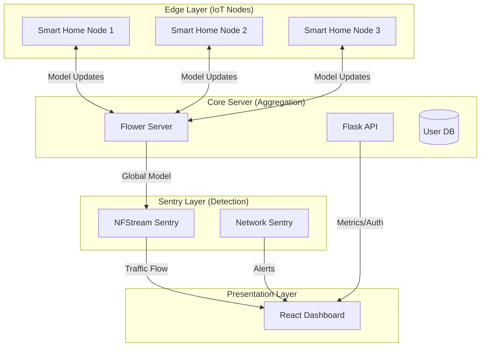

<p align="center">
  <h1 align="center">🛡️ Argus-FL</h1>
  <p align="center">
    <strong>Federated Learning-Powered Intrusion Detection System</strong>
  </p>
  <p align="center">
    
    
    
    
    
    
  </p>
</p>

---

**Argus-FL** is a next-generation Intrusion Detection System (IDS) that leverages **Federated Learning (FL)** to collaboratively train machine learning models across multiple edge nodes — without sharing sensitive raw data. It combines real-time packet analysis with a decentralized training architecture to detect network attacks like DDoS, Port Scanning, and specialized malware.

## 🏗️ Architecture



## 🚀 Key Features

- **Federated Learning** — Privacy-preserving model training across distributed nodes using the [Flower](https://flower.ai/) framework
- **Real-Time IDS** — Live traffic analysis using `NFStream` and `Scapy` to detect anomalies and known attack signatures
- **Dynamic Dashboard** — React-based command center with real-time visualization of training metrics (Accuracy, F1-Score), node status, and intrusion alerts
- **Dual Detection Engine** — Rule-based `FloodTracker` for volumetric attacks + ML inference for learned threat patterns
- **Attack Simulation** — Integrated Kali Linux tools to simulate SYN Floods, UDP Floods, Port Scans, and Slowloris attacks
- **Secure Architecture** — Role-based access with OTP verification, session management, and encrypted communication

## 🛠️ Installation & Setup

### Prerequisites

| Requirement | Purpose |
|---|---|
| Python 3.9+ | Backend, FL, ML |
| Node.js 18+ | React frontend |
| Npcap (Windows) / libpcap (Linux) | Packet capture |
| Kali Linux VM *(optional)* | Attack simulation |

### 1. Clone the Repository

```bash
git clone https://github.com/Dinu-Sreekumar/Argus-FL.git
cd Argus-FL
```

### 2. Backend Setup

```bash
# Create and activate virtual environment
python -m venv venv

# Windows
venv\Scripts\activate
# Linux/Mac
source venv/bin/activate

# Install dependencies
pip install -r requirements.txt
```

### 3. Environment Configuration

Copy the example environment file and fill in your values:

```bash
cd backend
cp .env.example .env
```

Edit `backend/.env` with your configuration:

```env
SECRET_KEY=your_secret_key_here          # Flask session secret
MAIL_USERNAME=your_email@gmail.com       # Gmail for OTP delivery
MAIL_PASSWORD=your_gmail_app_password    # Gmail App Password (not regular password)
MAIL_SENDER_ALIAS=your_email+noreply@gmail.com
```

> **Note:** To generate a Gmail App Password, go to [Google Account → Security → App Passwords](https://myaccount.google.com/apppasswords) and create one for "Mail".

### 4. Frontend Setup

```bash
cd frontend
npm install
cd ..
```

### 5. Running the System

The easiest way to launch the full system (Backend + 3 Nodes + Frontend):

- **Windows:** Double-click `launch_Argus-FL.bat`

Or run components manually:

```bash
# Terminal 1 — Server
python backend/server.py

# Terminal 2 — FL Client Node
python backend/client.py --node_id 1

# Terminal 3 — Frontend
cd frontend && npm start
```

## 📂 Project Structure

```
Argus-FL/
├── backend/
│   ├── api/              # REST API routes (auth, reports)
│   ├── core/             # Server config, DB models, Flower server
│   ├── sentry/           # IDS engines (NFStream + ML inference)
│   ├── models/           # ML model definitions
│   ├── data/             # Dataset storage & partitioning
│   ├── utils/            # Helper utilities
│   ├── server.py         # Main Flask + SocketIO server
│   ├── client.py         # Federated Learning client node
│   └── .env.example      # Environment variable template
├── frontend/
│   ├── src/
│   │   ├── components/   # React UI components
│   │   ├── pages/        # Application views
│   │   ├── hooks/        # Custom React hooks
│   │   └── App.js        # Root application component
│   └── package.json
├── Attacker/
│   ├── attacks.sh        # Attack simulation scripts
│   └── setup.sh          # Kali Linux environment setup
├── scripts/              # Utility scripts & plots
├── launch_Argus-FL.bat   # One-click system launcher (Windows)
├── requirements.txt      # Python dependencies
└── README.md
```

## ⚔️ Attack Simulation

The `Attacker/` directory contains tools for testing the IDS with real attack traffic:

| Attack | Tool | Description |
|---|---|---|
| SYN Flood | `hping3` | TCP SYN flood targeting port 80 |
| UDP Flood | `hping3` | High-volume UDP packet flood |
| Port Scan | `nmap` | Comprehensive port scanning |
| Slowloris | `slowloris` | Slow HTTP connection exhaustion |

> Requires a Kali Linux VM. See `Attacker/README.md` for setup instructions.

## 🧠 Tech Stack

| Layer | Technologies |
|---|---|
| **Frontend** | React 19, Recharts, Socket.IO Client, Framer Motion, GSAP, Three.js, TailwindCSS |
| **Backend** | Flask 3.0, Flask-SocketIO, Flask-SQLAlchemy, Flask-Login |
| **ML / FL** | TensorFlow, Flower (flwr), scikit-learn, NumPy, Pandas |
| **Network** | NFStream, Scapy, psutil |
| **Reports** | jsPDF, FPDF |

---

<p align="center">
  <sub>Built with ❤️ by <a href="https://github.com/Dinu-Sreekumar">Dinu Sreekumar</a></sub>
</p>
